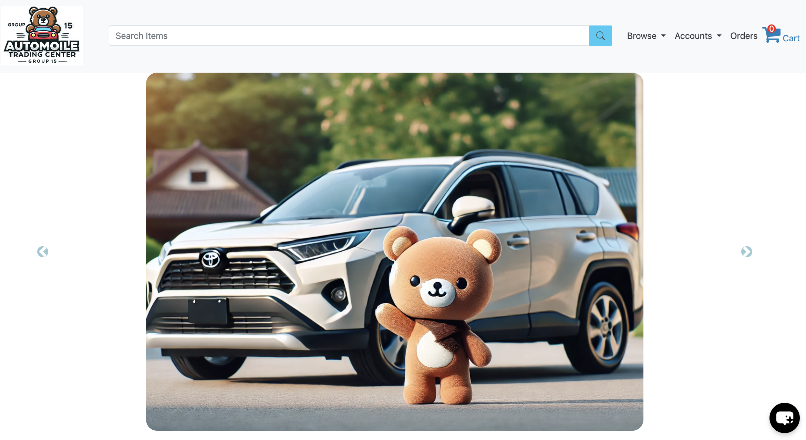

<strong><a href="https://github.com/lijing-code/CSCI6806Team15-frontend"> < Check out the frontend > </a></strong>

# 
Refining and Implementing of Cloud Automobile Trading Center Application

</img>

 
 

Abstract—Buying and selling vehicles are still outdated, relying
on in-person negotiations that are time-consuming and often
lead to disagreements. Our work is based on the original
paper, ”Design and Implementation of Cloud Automobile Trading
Center,” which suggested using a cloud-based system to improve
the efficiency of vehicle trading. The goal of our project was
to address the shortcomings of the original work, especially the
lack of detailed implementation and source code. To do this,
we used popular frameworks like Vue.js and Spring Boot to
create an online platform where buyers and sellers can safely
conduct business. By addressing the common issues in vehicle
sales, our improvements made the platform more user-friendly,
transparent, and efficient for both consumers and dealerships. 
 

We have two goals for our project: first is to implement
the research by developing an online working vehicle trading
platform based on the principles laid out in the paper; sec-
ondly, to upgrade the above-mentioned platform with modern 
frameworks such as Vue.js, and Spring Boot. We want to
smoothen the process of trading a vehicle to let users search
and buy their favorite vehicles much more efficiently than with
traditional sales processes, with more useful functions: AI Hat
Box; Online Test Drive Reservation; Maintenance Booking
.etc.
 

If you're using this app, please ⭐ this repository!
 

## Techs

  
<strong>Back-End</strong>

    <ul>
        <li>Java</li>
    </ul>
    <ul>
        <li>Maven</li>
    </ul>
    <ul>
        <li>Spring Boot</li>
    </ul>
    <ul>
        <li>Spring Data</li>
    </ul>
    <ul>
        <li>Swagger</li>
    </ul>
    <ul>
        <li>PostgreSQL</li>
    </ul>
    <ul>
        <li>Lombok</li>
    </ul>
    <ul>
        <li>Stripe</li>
    </ul>

  
<strong>Front-End</strong>

    <ul>
        <li>Vue</li>
    </ul>
    <ul>
        <li>Vue Router</li>
    </ul>
    <ul>
        <li>Bootstrap</li>
    </ul>
    <ul>
        <li>Stripe</li>
    </ul>

##  Functionality

- Register
- Login / Logout
- Google Auto Signin / Signup
- QR Code for quick enter
- Chatbox
- Add / Edit Category
- Add / Edit Product
- Catalogue
- Wish list
- Cart management
- Checkout
- Payment
- Valitadions

## Demo

## Swagger Demo

## Architecture

</img>
